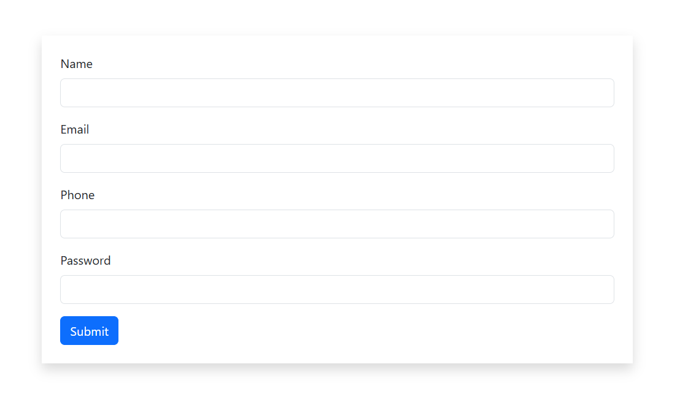

# Registration Form Validation

A responsive **Registration Form Validation** project built using **HTML5**, **Bootstrap 5**, and **JavaScript**.
The form validates user input before submission to ensure correct and complete information.

---

## 📸 Project Preview



---

## 🚀 Live Demo
https://joni250.github.io/registration-form-validation-js/

---

## ✨ Features

- Responsive Registration Form
- Bootstrap 5 UI
- Empty Field Validation
- Email Format Validation
- Phone Number Validation (11 Digits)
- Password Validation (Minimum 8 Characters)
- JavaScript Form Validation
- User-Friendly Alerts
- Clean and Simple Design

---

## 🛠 Technologies Used

- HTML5
- CSS3
- Bootstrap 5
- JavaScript (ES6)

---
## 💡 Learning Objectives

This project demonstrates:

- HTML Form Creation
- Bootstrap Form Components
- JavaScript DOM Manipulation
- Event Handling
- Client-side Validation
- Regular Expressions (Regex)
- User Input Validation
- Responsive Web Design

## 📁 Project Structure

```
registration-form-validation-js/
│── index.html
│── script.js
│── preview.png
└── README.md
```

---

## 📋 Validation Rules

| Field | Validation |
|-------|------------|
| 👤 Name | Cannot be Empty |
| 📧 Email | Must be a Valid Email Address |
| 📱 Phone | Must Contain Exactly 11 Digits |
| 🔒 Password | Minimum 8 Characters Required |

---

## 📖 How to Run
1. Clone this repository

```bash
git clone https://github.com/Joni250/registration-form-validation-js.git
```

2. Open the project folder.

3. Run `index.html` in your browser.

---

## ⭐ Repository Stats

If you found this project helpful:

⭐ Star this repository

🍴 Fork this repository

💻 Practice and improve your JavaScript skills

## 👩‍💻 Author

** MSt Joni Khatun**
Aspiring Fron-end-Developer

GitHub:
https://github.com/Joni250

---

## ⭐ Support

If you like this project, don't forget to give it a ⭐ on GitHub.
